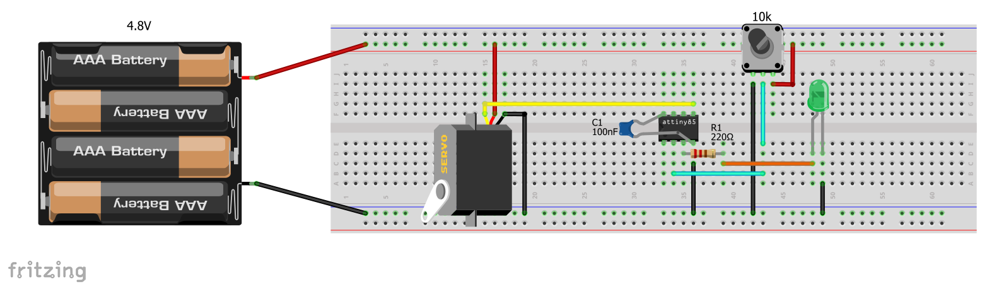

# ATTINY85 Servo Control

An RC servo control using an [AVR ATTINY85 microcontroller](https://www.microchip.com/wwwproducts/en/ATtiny85). The control offers a full 8-bit resolution for a standard RC servo. The control is setup via the *8-bit Timer/Counter1* as it offers the the required prescaler (CK/32) to get a 250 kHz timer frequency from an 8 MHz clocked CPU. This allows for approximately 256 steps (8-bit) over a 1 millisecond period.

## Features
 - The servo can be moved to 256 positions within its 1ms-2ms duty range
 - A standard RC servo normally operates a total angle of approximately 90° (+/- 45°)
 - This is done via a 50 Hz PWM signal with a duty cycle of 5% (minimum position) to 10% (maximum position)
 - This means a 20 millisecond PWM signal with a duty cycle of 1 ms to 2 ms
 - To get the full resolution of the 8-bit microcontroller, the *8-bit Timer/Counter1* is setup so that it takes the 8-bit range (256 steps) for the complete duty cycle variation, i.e. 1 millisecond
 - With this setup a resolution of 0.35° per step is possible which is enough for a smooth servo motion
 - A potentiometer can be attached (configured in function *Init_ADC* via the MUX bits for PB3) and used to control the servo position (tested with a 10k potentiometer)
 - An LED attached to LED_PORT indicates the servo center position (use a 200 &Omega; resistor for the LED)
 - The pins for servo and LED can be configured by the corresponding macros (SERVO_PORT, LED_PORT). Do not use VCC, GND and RESET pins

## Example Breadboard Configuration

Obviously, before use, the code *main.c* needs to be programmed on the device via any ISP programmer.

## Credits
 - The idea was found in the [AVR Freaks Forum](https://www.avrfreaks.net/comment/810846#comment-810846) posted by user **JimK**

## Prerequisites
 - For the code to work the CPU needs to run at 8 MHz (this is NOT the factory default)
 - The fuse **CKDIV8** has to be unset, otherwise the CPU would run at 1 MHz
 - As an alternative the **CKDIV8** could be left as is (factory default), but then the prescaler for the *8-bit Timer/Counter1* has to be set to **4** (using the CS1x bits in the *8-bit Timer/Counter1* control register TCCR1). This alternative is untested.

 ## Additional information
 - Official MICROCHIP [ATTINY85 datasheet](http://ww1.microchip.com/downloads/en/DeviceDoc/Atmel-2586-AVR-8-bit-Microcontroller-ATtiny25-ATtiny45-ATtiny85_Datasheet.pdf)
  
Distributed under the MIT license. See [LICENSE](https://github.com/chiefenne/ATTINY85-Servo-Control/blob/master/LICENSE) for more information.

